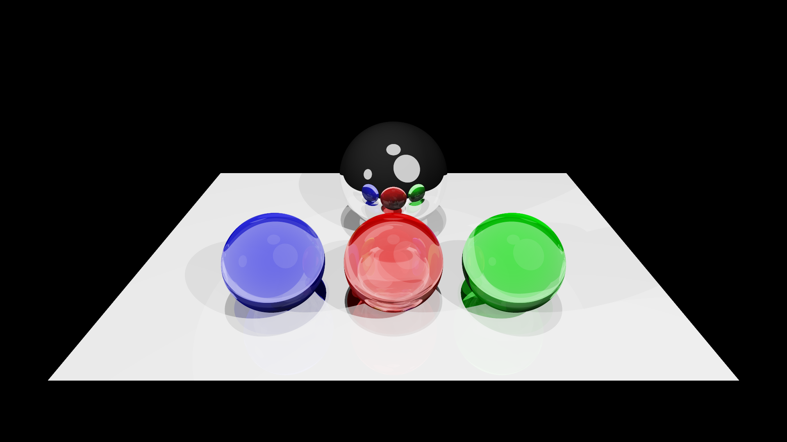

# Build Your Own Ray Tracer

Simple ray tracing engine implemented in Rust.
CPU-based implementation without any external rendering libraries.

## Features

- Basic ray tracing functionalities
- Support for spheres and triangles
- Sphere light sources
- Multiple material types (diffuse, reflective, refractive)
- Multiple tone mapping operators (Reinhard, ACES Filmic, Exposure)

## Example

[](assets/output.mp4)

## Building and Running

```shell
mkdir output
cargo build --release
ffmpeg -r 60 -i output/frame_%03d.png -vcodec libx264 -pix_fmt yuv420p -r 60 output.mp4
```
